# 06 - AS-IS RUNTIME DATA FLOW: TOÀN BỘ LUỒNG DỮ LIỆU THỊ TRƯỜNG HIỆN TẠI

> Tài liệu này mô tả **runtime hiện tại của UAT/PROD** theo code và deploy scripts đã đối chiếu. Trọng tâm là: `init job`, `websocket ingest`, `realtime write`, `remove market data`, `persist Mongo`, `query/ws delivery`, cùng các input/output cụ thể ở từng lớp.

---

## 1. KẾT LUẬN NHANH VỀ RUNTIME HIỆN TẠI

### 1.1. Hai giả định nền

1. `market-collector-lotte` hiện ingest thị trường chủ yếu qua **`app.realtime.websocketConnections`**.
2. `realtime-v2` hiện chạy với:
   - `enableSaveQuote=false`
   - `enableSaveQuoteMinute=false`
   - `enableSaveBidAsk=false`

### 1.2. Hệ quả trực tiếp

- **Active ingest path**: `Lotte WebSocket -> WsConnection -> Kafka`
- **Intraday hot state**: nằm chủ yếu ở **Redis**
- **Mongo runtime hiện tại**: chỉ giữ **snapshot/day-level state**, không giữ tick/minute/bid-offer theo event
- `market-query-v2` là **Redis-first** cho intraday
- `ws-v2` consume **Kafka trực tiếp**, không chờ Mongo

### 1.3. Bức tranh tổng thể

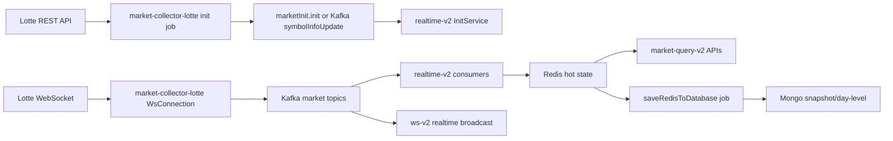

---

## 2. VAI TRÒ TỪNG SERVICE

| Service | Input | Output | Vai trò runtime |
|---|---|---|---|
| `market-collector-lotte` | Lotte REST API, Lotte WebSocket | Kafka `symbolInfoUpdate`, `quoteUpdate`, `bidOfferUpdate`, `marketStatus`, DR topics | init market data và convert raw feed sang contract nội bộ |
| `realtime-v2` | Kafka market topics | Redis hot state, Mongo snapshot chọn lọc | hợp nhất state realtime, tạo minute bar, statistic, market status |
| `market-query-v2` | Redis + Mongo | REST responses | query board, tick, minute, daily, statistic |
| `ws-v2` | Kafka market topics | SocketCluster publish | fan-out realtime tới client |

---

## 3. INPUT/OUTPUT CHÍNH CỦA REDIS VÀ MONGODB

### 3.1. Redis hot state

| Key | Kiểu | Dữ liệu | Writer active |
|---|---|---|---|
| `realtime_mapSymbolInfo` | Hash | latest `SymbolInfo` theo mã | `QuoteService`, `BidOfferService`, `ExtraQuoteService`, `MarketStatusService` |
| `realtime_mapSymbolInfoOddLot` | Hash | latest odd-lot info | odd-lot flows |
| `realtime_mapSymbolDaily` | Hash | `SymbolDaily` trong ngày | `QuoteService`, `ExtraQuoteService` |
| `realtime_mapForeignerDaily` | Hash | `ForeignerDaily` trong ngày | `QuoteService`, `ExtraQuoteService` |
| `realtime_listQuote_{code}` | List | tick `SymbolQuote` | `QuoteService` |
| `realtime_listQuoteMeta_{code}` | String/encoded object | metadata partition tick | `QuoteService` |
| `realtime_listQuoteMinute_{code}` | List | `SymbolQuoteMinute` | `QuoteService` |
| `realtime_mapSymbolStatistic` | Hash | statistic matched buy/sell/unknown | `QuoteService` |
| `realtime_listBidOffer_{code}` | List | bid-offer history | code path có, runtime hiện tại không ghi |
| `realtime_listBidOfferOddLot_{code}` | List | odd-lot bid-offer history | odd-lot flows |
| `realtime_mapMarketStatus` | Hash | `MarketStatus` theo market/type | `MarketStatusService` |
| `realtime_listDealNotice_{market}` | List | put-through deals | `DealNoticeService` |
| `realtime_listAdvertised_{market}` | List | put-through advertised | `AdvertisedService` |

### 3.1a. Redis sample thực tế từ dump runtime

> Các raw sample dưới đây lấy từ dump Redis do user cung cấp để neo lại shape dữ liệu thực tế trong ngày. Bộ sample này không cùng một ngày:
> - `realtime_listQuote_SHB`, `realtime_listQuoteMinute_SHB`, `realtime_mapSymbolInfo[SHB]`, `realtime_mapSymbolDaily[SHB]`, `realtime_mapSymbolStatistic[SHB]` thuộc ngày giao dịch `2026-04-20`.
> - `realtime_mapForeignerDaily[SHB]` có `date=1720758584000`, tương ứng ngày `2024-07-12`.
> - `realtime_mapSymbolInfoOddLot[SHB]` và `realtime_listBidOfferOddLot_DGC` có `updatedAt` ngày `2024-02-28`.
> - Raw value hiện được dump với tiền tố `4` trước object JSON.

#### A. Quote / minute / market status

`realtime_listQuote_SHB`

```text
4{"code":"SHB","type":"STOCK","time":"074500","open":15200.0,"high":15300.0,"low":15150.0,"last":15300.0,"change":0.0,"rate":0.0,"highTime":"144500","lowTime":"091606","averagePrice":15250.0,"referencePrice":15300.0,"tradingVolume":47390400,"tradingValue":7.2155262E11,"turnoverRate":1.0315,"matchingVolume":100,"foreignerBuyVolume":804300,"foreignerSellVolume":95278,"foreignerTotalRoom":1378260007,"foreignerCurrentRoom":1227600932,"matchedBy":"ASK","holdVolume":150659075,"holdRatio":0.03279332075507385,"buyAbleRatio":89.06889308005583,"date":1776671100000,"milliseconds":27900000,"sequence":8928,"foreignerMatchBuyVolume":0,"foreignerMatchSellVolume":0,"foreignerMatchBuyValue":0.0,"foreignerMatchSellValue":0.0,"createdAt":1776671118783,"updatedAt":1776671118783,"activeBuyVolume":15891000,"activeSellVolume":31499400}
```

`realtime_listQuoteMinute_SHB`

```text
4{"code":"SHB","time":"074500","milliseconds":27900000,"open":15300.0,"high":15300.0,"low":15300.0,"last":15300.0,"tradingVolume":47390400,"tradingValue":7.2155262E11,"periodTradingVolume":8363800,"date":1776671100000}
```

`realtime_mapMarketStatus[HOSE_EQUITY]`

```text
4{"id":"HOSE_EQUITY","market":"HOSE","status":"LO","date":1745892901611,"time":"021501","type":"EQUITY","title":"(HOSE) Market Open"}
```

#### B. SymbolInfo / daily / foreigner / statistic

`realtime_mapSymbolInfo[SHB]`

```text
4{"code":"SHB","time":"074500","date":"20260420","open":15200.0,"high":15300.0,"low":15150.0,"last":15300.0,"change":0.0,"rate":0.0,"tradingVolume":47390400,"tradingValue":7.2155262E11,"matchingVolume":100,"type":"STOCK","upCount":0,"ceilingCount":0,"unchangedCount":0,"downCount":0,"floorCount":0,"highTime":"144500","lowTime":"091606","ceilingPrice":16350.0,"floorPrice":14250.0,"referencePrice":15300.0,"averagePrice":15250.0,"turnoverRate":1.0315,"foreignerBuyVolume":804300,"foreignerSellVolume":95278,"foreignerTotalRoom":1378260007,"foreignerCurrentRoom":1227600932,"matchedBy":"ASK","bidOfferList":[{"bidPrice":15250.0,"bidVolume":9000,"offerPrice":15300.0,"offerVolume":3368800},{"bidPrice":15200.0,"bidVolume":662400,"offerPrice":15350.0,"offerVolume":3803500},{"bidPrice":15150.0,"bidVolume":3096400,"offerPrice":15400.0,"offerVolume":4194100}],"expectedPrice":15300.0,"name":"Ngân hàng Thương mại Cổ phần Sài Gòn – Hà Nội","nameEn":"Sai Gon – Ha Noi Commercial Joint Stock Bank","marketType":"HOSE","securitiesType":"STOCK","bidofferTime":"074500","updatedAt":1776671118783,"listedQuantity":4594200024,"ptTradingVolume":0,"ptTradingValue":0.0,"foreignerBuyValue":0.0,"foreignerSellValue":0.0,"securityExchange":"HOSE","controlCode":"Y","highLowYearData":[{"highPrice":21500.0,"lowPrice":11800.0}],"exchange":"HOSE","isHighlight":1000,"tradeCount":0,"unTradeCount":0,"quoteSequence":8928,"bidAskSequence":27341,"updatedBy":"SymbolQuote","marketName":"HOSE","id":"SHB"}
```

`realtime_mapSymbolDaily[SHB]`

```text
4{"id":"SHB_20260420","code":"SHB","date":1776686400000,"change":0.0,"rate":0.0,"tradingVolume":47390400,"tradingValue":7.2155262E11,"open":15200.0,"high":15300.0,"low":15150.0,"last":15300.0,"referencePrice":15300.0,"createdAt":1776649851171,"updatedAt":1776671118784}
```

`realtime_mapForeignerDaily[SHB]`

```text
4{"code":"SHB","symbolType":"STOCK","date":1720758584000,"foreignerBuyAbleRatio":89.54783184403507,"foreignerCurrentRoom":984016554,"foreignerTotalRoom":1098872562,"foreignerBuyValue":0.0,"foreignerSellValue":0.0,"foreignerBuyVolume":979000,"foreignerSellVolume":58654,"foreignerHoldVolume":114856008,"foreignerHoldRatio":0.031356504450773696,"listedQuantity":3.662908542E9,"createdAt":1720749045763,"updatedAt":1720758584866}
```

`realtime_mapSymbolStatistic[SHB]`

```text
4{"code":"SHB","type":"STOCK","time":"074500","tradingVolume":47390400,"totalBuyVolume":15891000,"totalBuyRaito":33.53210776866201,"totalSellVolume":31479000,"totalSellRaito":66.42484553833687,"prices":[{"price":15200.0,"matchedVolume":30874000,"matchedRaito":65.14821567237247,"matchedBuyVolume":12837300,"buyRaito":41.57964630433374,"matchedSellVolume":18036700,"sellRaito":58.42035369566626},{"price":15250.0,"matchedVolume":3986200,"matchedRaito":8.4114082176981,"matchedBuyVolume":1508700,"buyRaito":37.84807586172295,"matchedSellVolume":2477500,"sellRaito":62.15192413827706},{"price":15150.0,"matchedVolume":1545000,"matchedRaito":3.2601539552314396,"matchedBuyVolume":1545000,"buyRaito":100.0},{"price":15300.0,"matchedVolume":10964800,"matchedRaito":23.137175461696884,"matchedSellVolume":10964800,"sellRaito":100.0}]}
```

#### C. Odd-lot sample

`realtime_mapSymbolInfoOddLot[SHB]`

```text
4{"code":"SHB","tradingVolume":0,"tradingValue":0.0,"upCount":0,"ceilingCount":0,"unchangedCount":0,"downCount":0,"floorCount":0,"foreignerBuyVolume":0,"foreignerSellVolume":0,"oddlotBidofferTime":"085900","updatedAt":1709110740140,"ptTradingVolume":0,"ptTradingValue":0.0,"foreignerBuyValue":0.0,"foreignerSellValue":0.0,"highLowYearData":[],"isHighlight":1000,"tradeCount":0,"unTradeCount":0,"quoteSequence":0,"bidAskSequence":1,"updatedBy":"BidOfferOddLot","oddlotBidOfferList":[{"bidPrice":11900.0,"bidVolume":254,"offerPrice":11950.0,"offerVolume":333},{"bidPrice":11850.0,"bidVolume":1695,"offerPrice":12000.0,"offerVolume":879},{"bidPrice":11800.0,"bidVolume":2641,"offerPrice":12050.0,"offerVolume":45}],"id":"SHB"}
```

`realtime_listBidOfferOddLot_DGC`

```text
4{"id":"DGC_20240228085900_2","code":"DGC","time":"085900","bidOfferList":[{"bidPrice":110700.0,"bidVolume":5,"offerPrice":111000.0,"offerVolume":79},{"bidPrice":110600.0,"bidVolume":34,"offerPrice":111200.0,"offerVolume":54},{"bidPrice":110500.0,"bidVolume":359,"offerPrice":112100.0,"offerVolume":14}],"updatedAt":1709110740076,"createdAt":1709110740076,"sequence":2}
```

Những điểm nổi bật từ sample:

- `realtime_mapSymbolInfo[SHB]` là object hợp nhất: vừa có OHLCV/foreigner/day state, vừa có `bidOfferList`, `quoteSequence`, `bidAskSequence`.
- `realtime_listQuote_SHB` và `realtime_listQuoteMinute_SHB` giữ event-level history; candle phút mang thêm `periodTradingVolume`.
- `realtime_mapSymbolStatistic[SHB]` lưu breakdown matched volume theo từng mức giá.
- Odd-lot đi nhánh riêng, không reuse `bidOfferList`; object dùng field `oddlotBidOfferList`.

### 3.2. Mongo snapshot/day-level store

| Collection | Runtime hiện tại | Ghi bởi |
|---|---|---|
| `c_symbol_info` | Có | `saveRedisToDatabase()` |
| odd-lot collection qua model `SymbolInfoOddLot` | Có | `saveRedisToDatabase()` |
| `c_symbol_daily` | Có | `saveRedisToDatabase()` |
| `c_foreigner_daily` | Có | `saveRedisToDatabase()` |
| `c_market_session_status` | Có | `saveRedisToDatabase()` |
| `c_deal_notice` | Có | `saveRedisToDatabase()` |
| `c_advertise` | Có | `saveRedisToDatabase()` |
| `c_symbol_previous` | Có | `updateSymbolPrevious()` |
| `c_symbol_quote` | Không | flag runtime đang tắt |
| `c_symbol_quote_minute` | Không | flag runtime đang tắt |
| `c_bid_offer` | Không | flag runtime đang tắt |

---

## 4. LUỒNG STARTUP

### 4.1. Collector startup

File chính:
- `services/market-collector-lotte/.../services/StartupService.java`
- `services/market-collector-lotte/.../services/realtime/RealTimeService.java`

Luồng:

1. JVM boot.
2. `StartupService.run()` gọi:
   - `GeneratedClassRegistration.register()`
   - `cacheService.init()`
   - `realTimeDataListenerService.run()`
3. `RealTimeService.run()`:
   - check weekday / working time
   - `downloadResource()`
   - `start()`
4. `downloadResource()`:
   - nếu cấu hình dùng Redis làm source symbol: lấy `getAllSymbolInfo()`
   - ngược lại: `DownloadSymbolListService.downloadFuture(false)` để load danh sách symbol nền
5. `start()`:
   - `appConf.realtime.accounts.forEach(startAccount)`
   - `appConf.realtime.websocketConnections.forEach(startWs)`

### 4.2. Runtime note rất quan trọng

Deploy scripts hiện tại set `accounts: []`, nên:

- code path `startAccount()` vẫn tồn tại
- nhưng **không phải nhánh active runtime**
- nhánh đang chạy là `startWs()`

---

## 5. LUỒNG INIT MARKET / DOWNLOAD SYMBOL

### 5.1. Mục tiêu của init job

Init job tạo **baseline market state đầu ngày**:

- toàn bộ `SymbolInfo`
- bid/offer snapshot ban đầu từ API
- index list / index info
- futures metadata
- file static để client preload

### 5.2. Trigger

File:
- `services/market-collector-lotte/.../job/JobService.java`
- `services/market-collector-lotte/.../services/LotteApiSymbolInfoService.java`

Trigger có 2 loại:

- startup flow
- cron `downloadSymbol`

### 5.3. Input/Output ở từng lớp

| Bước | Class.method | Input | Convert | Output |
|---|---|---|---|---|
| 1 | `JobService.downloadSymbol()` | cron | gọi service | `symbolInfoService.downloadSymbol("JobScheduler")` |
| 2 | `LotteApiSymbolInfoService.downloadSymbol(id)` | logical init request | orchestration | build full market universe |
| 3 | `downloadSymbolList()` | API `securities-name` | paginated REST -> `Map<String, SymbolNameResponse.Item>` | symbol names / type / exchange |
| 4 | `downloadIndexList()` | API index list | paginated REST | index map |
| 5 | `downloadSymbolInfo()` | APIs `best-bid-offer`, `securities-price` | batch query + merge | `Map<String, SymbolInfo>` cho stock/CW/ETF/bond |
| 6 | `downloadIndexInfo()` | index APIs | REST -> `SymbolInfo(type=INDEX)` | index info |
| 7 | `downloadDerivatives()` | DR APIs | REST -> `SymbolInfo(type=FUTURES)` | futures info |
| 8 | `merge(...)` | `symbolName + symbolPrice + bidAskResponse` | map field | `SymbolInfo` hoàn chỉnh |
| 9a | `marketInit.init(allSymbols)` | `enableInitMarket=true` | init trực tiếp | Redis + Mongo + static file |
| 9b | `marketInit.sendSymbolInfoUpdate(...)` | `enableInitMarket=false` | publish grouped updates | Kafka `symbolInfoUpdate` |

### 5.3a. Data sample thực tế từ log init job

> Mẫu dưới đây lấy từ log runtime ngày **2026-04-20** của `LotteApiSymbolInfoService`. Mục đích là gắn raw input thật vào các bước `downloadSymbolList()` và `downloadSymbolInfo()`.

#### A. Sample `downloadSymbolList()` -> API `securities-name`

Log request/response:

```text
2026-04-20T06:48:54.249Z  INFO ... LotteApiSymbolInfoService : null__null query tsol/apikey/tuxsvc/market/securities-name with data {
  "error_code":"0000",
  "error_desc":"SUCCESS",
  "success":true,
  "data_list":[
    {
      "nextKey":"1200",
      "hasNext":"true",
      "list":[
        {"symbol":"SBV","code":"SBV","exchange":"HSX","englishName":"Siam Brothers Vietnam Joint Stock Company","vietnameseName":"Công ty Cổ phần Siam Brothers Việt Nam","type":"stock"},
        {"symbol":"SC5","code":"SC5","exchange":"HSX","englishName":"Construction Joint Stock Company No.5","vietnameseName":"Công ty Cổ phần Xây dựng Số 5","type":"stock"},
        {"symbol":"SHB","code":"SHB","exchange":"HSX","englishName":"Sai Gon – Ha Noi Commercial Joint Stock Bank","vietnameseName":"Ngân hàng Thương mại Cổ phần Sài Gòn – Hà Nội","type":"stock"},
        {"symbol":"SSB","code":"SSB","exchange":"HSX","englishName":"Southeast Asia Commercial Joint Stock Bank","vietnameseName":"Ngân hàng Thương mại Cổ phần Đông Nam Á","type":"stock"}
      ]
    }
  ]
}
```

Trang tiếp theo:

```text
2026-04-20T06:48:57.699Z  INFO ... LotteApiSymbolInfoService : null__null query tsol/apikey/tuxsvc/market/securities-name with data {
  "error_code":"0000",
  "error_desc":"SUCCESS",
  "success":true,
  "data_list":[
    {
      "nextKey":"1900",
      "hasNext":"true",
      "list":[
        {"symbol":"CMSN2606","code":"CMSN2606","exchange":"HSX","englishName":"Chung quyen MSN.6M.SSV.C.EU.Cash.25.02","vietnameseName":"Chứng quyền MSN.6M.SSV.C.EU.Cash.25.02","type":"coveredwarrant"},
        {"symbol":"CMWG2601","code":"CMWG2601","exchange":"HSX","englishName":"Chung quyen MWG/TCBS/C/EU/6M/CASH/02","vietnameseName":"Chứng quyền MWG/TCBS/C/EU/6M/CASH/02","type":"coveredwarrant"},
        {"symbol":"CSHB2505","code":"CSHB2505","exchange":"HSX","englishName":"Chứng quyền.SHB.KIS.M.CA.T.12","vietnameseName":"Chứng quyền.SHB.KIS.M.CA.T.12","type":"coveredwarrant"},
        {"symbol":"CSTB2601","code":"CSTB2601","exchange":"HSX","englishName":"Chung quyen STB/TCBS/C/EU/6M/CASH/02","vietnameseName":"Chứng quyền STB/TCBS/C/EU/6M/CASH/02","type":"coveredwarrant"}
      ]
    }
  ]
}
```

Ý nghĩa runtime:

- `downloadSymbolList()` đang nhận dữ liệu phân trang qua `nextKey`.
- Một page có thể chứa nhiều loại instrument; trong sample đã thấy `stock` và `coveredwarrant`.
- Code cộng dồn toàn bộ page vào `Map<String, SymbolNameResponse.Item>` trước khi sang bước query giá và bid/ask.

#### B. Sample `downloadSymbolInfo()` -> API `best-bid-offer`

Log request/response cho equity:

```text
2026-04-20T06:49:00.222Z  INFO ... request http://172.33.30.33:8100/tsol/apikey/tuxsvc/market/best-bid-offer-{"stk_cd":"SHB","bo_cnt":"10"} ... status code 200
2026-04-20T06:49:00.222Z  INFO ... query tsol/apikey/tuxsvc/market/best-bid-offer with data {
  "error_code":"0000",
  "error_desc":"SUCCESS",
  "success":true,
  "data_list":[
    {
      "code":"SHB",
      "time":"00:00:00",
      "ceiling":"16500",
      "floor":"14400",
      "refPrice":"18100",
      "last":"18100",
      "change":"0",
      "changeRate":"0.0",
      "matchedVol":"0",
      "totalBidSize":"0",
      "totalOfferSize":"0",
      "marketName":"HSX",
      "controlCode":"",
      "bidOfferList":[
        {"bid":"0","bidSize":"0","offer":"0","offerSize":"0"},
        {"bid":"0","bidSize":"0","offer":"0","offerSize":"0"},
        {"bid":"0","bidSize":"0","offer":"0","offerSize":"0"}
      ]
    }
  ]
}
```

Log request/response cho CW:

```text
2026-04-20T06:49:05.610Z  INFO ... request http://172.33.30.33:8100/tsol/apikey/tuxsvc/market/best-bid-offer-{"stk_cd":"CSHB2505","bo_cnt":"10"} ... status code 200
2026-04-20T06:49:05.610Z  INFO ... query tsol/apikey/tuxsvc/market/best-bid-offer with data {
  "error_code":"0000",
  "error_desc":"SUCCESS",
  "success":true,
  "data_list":[
    {
      "code":"CSHB2505",
      "time":"00:00:00",
      "ceiling":"3790",
      "floor":"2510",
      "refPrice":"1180",
      "last":"1180",
      "change":"0",
      "changeRate":"0.0",
      "matchedVol":"0",
      "totalBidSize":"0",
      "totalOfferSize":"0",
      "marketName":"HSX",
      "controlCode":"",
      "bidOfferList":[
        {"bid":"0","bidSize":"0","offer":"0","offerSize":"0"},
        {"bid":"0","bidSize":"0","offer":"0","offerSize":"0"},
        {"bid":"0","bidSize":"0","offer":"0","offerSize":"0"}
      ]
    }
  ]
}
```

Ý nghĩa runtime:

- Collector gọi `best-bid-offer` theo từng mã trước khi gọi `securities-price` batch.
- Trước giờ giao dịch hoặc khi chưa có depth thật, API vẫn trả được baseline:
  - `ceiling`, `floor`, `refPrice`, `last`
  - `matchedVol = 0`
  - `totalBidSize = 0`, `totalOfferSize = 0`
  - `bidOfferList` toàn số `0`
- Ở bước `merge(...)`, các dòng bid/offer toàn `0` sẽ bị filter bỏ, nên `SymbolInfo.bidOfferList` sau merge có thể rỗng dù raw response vẫn có đủ levels.

#### C. Ghi chú về sample còn thiếu

Từ log bạn cung cấp, hiện đã có raw sample thật cho:

- `downloadSymbolList()` -> `securities-name`
- `downloadSymbolInfo()` phần `best-bid-offer`

Chưa có raw sample log cho:

- `downloadSymbolInfo()` phần `securities-price`
- `downloadIndexList()` / `downloadIndexInfo()`
- `downloadDerivatives()`
- output cuối `marketInit.init(allSymbols)` hoặc `symbolInfoUpdate`

Các bước đó trong tài liệu hiện vẫn mô tả theo code path đã đọc, chưa có raw payload runtime đi kèm.

### 5.4. `merge(...)` tạo `SymbolInfo` như nào

`LotteApiSymbolInfoService.merge(...)` map các nhóm field sau:

- giá cơ bản:
  - `open`, `high`, `low`, `last`
  - `change`, `rate`
  - `tradingVolume`, `tradingValue`
- thời gian:
  - `time`, `highTime`, `lowTime`
- biên độ:
  - `ceilingPrice`, `floorPrice`, `referencePrice`
- intraday summary:
  - `averagePrice`, `turnoverRate`
  - `matchingVolume`
  - `bidOfferList`
  - `totalBidVolume`, `totalOfferVolume`
  - `expectedPrice`
- foreigner:
  - `foreignerBuyVolume`
  - `foreignerSellVolume`
  - `foreignerTotalRoom`
  - `foreignerCurrentRoom`
- instrument metadata:
  - `code`, `name`, `nameEn`
  - `type`, `securitiesType`
  - `exchange`, `marketType`, `marketName`
  - `listedQuantity`
  - `controlCode`
  - `underlyingSymbol` cho CW
  - `highLowYearData`

### 5.5. Hai mode init

| Mode | Điều kiện | Output thực tế |
|---|---|---|
| Direct init | `enableInitMarket=true` | `marketInit.init(allSymbols)` ghi trực tiếp baseline |
| Distributed init | `enableInitMarket=false` | publish `symbolInfoUpdate`, `realtime-v2/InitService` nhận rồi init |

### 5.6. `InitService` phía realtime-v2

`realtime-v2/InitService` gom `SymbolInfoUpdate` theo `groupId`:

1. nhận đủ message hoặc timeout 60s
2. `monitorService.pauseAll(...)`
3. clean symbol cache theo command
4. `symbolInfoService.updateBySymbolInfoUpdate(...)`
5. `marketInit.init(cacheService.getMapSymbolInfo().values())`
6. `cacheService.reset()`
7. resume threads

### 5.7. Output phụ của init

- `symbol_static_data.json` qua `uploadMarketDataFile()`
- baseline `realtime_mapSymbolInfo`
- baseline `c_symbol_info`

Lưu ý:
- source `MarketInit` không nằm trong workspace này, nên phần field-level bên trong thư viện đó không thể liệt kê đầy đủ hơn từ code local.

---

## 6. LUỒNG WEBSOCKET INGEST ACTIVE RUNTIME

### 6.1. Active runtime path

```mermaid
flowchart TD
  A[RealTimeService.startWs] --> B[WsConnectionThread.run]
  B --> C[new WsConnection(...)]
  C --> D[WsConnection.start]
  D --> E[subscribe channels]
  E --> F[handleMessage]
  F --> G[handleStockQuote]
  F --> H[handleStockBidAsk]
  F --> I[handleIndexQuote]
  F --> J[handleSessionEvent]
  G --> K[QuoteUpdate]
  H --> L[BidOfferUpdate]
  I --> M[QuoteUpdate type=INDEX]
  J --> N[MarketStatusData]
  K --> O[RequestSender.sendMessageSafe quoteUpdate]
  L --> P[RequestSender.sendMessageSafe bidOfferUpdate]
  M --> O
  N --> Q[RequestSender.sendMessageSafe marketStatus]
```

### 6.2. Input channels hiện tại

Từ deploy scripts:

- `sub/pro.pub.auto.qt./...`
- `sub/pro.pub.auto.bo./...`
- `sub/pro.pub.auto.idxqt./...`
- `sub/pro.pub.auto.tickerNews.*/`
- một số node/instance UAT còn có `dr.qt` và `dr.bo` cho futures

### 6.3. `handleStockQuote(parts)` nhận gì, convert gì

Input là raw line:

```text
auto.qt.BCM|1|93020|BCM|91500|91903|55800.0|2|55800.0|2|55600.0|5|55800.0|2|100.0|2|...
```

Output object `QuoteUpdate`:

| Raw parts | Field output |
|---|---|
| `parts[2]` | `time` |
| `parts[3]` | `code` |
| `parts[4]` | `highTime` |
| `parts[5]` | `lowTime` |
| `parts[6]` | `open` |
| `parts[8]` | `high` |
| `parts[10]` | `low` |
| `parts[12]` | `last` |
| `parts[14]` | `change` |
| `parts[16]` | `rate` |
| `parts[17]` | `turnoverRate` |
| `parts[18]` | `averagePrice` |
| `parts[20]` | `referencePrice` |
| `parts[21]` | `tradingValue` |
| `parts[22]` | `tradingVolume` |
| `parts[23]` | `matchingVolume` |
| `parts[24]` | `matchedBy` (`83=ASK`, `66=BID`) |
| `parts[25]` | `foreignerBuyVolume` |
| `parts[26]` | `foreignerSellVolume` |
| `parts[27]` | `foreignerTotalRoom` |
| `parts[28]` | `foreignerCurrentRoom` |
| `parts[33]` | `activeSellVolume` |
| `parts[34]` | `activeBuyVolume` |

### 6.4. Time conversion nuance

`WsConnection.handleStockQuote()` đang làm:

- `time`: parse theo timezone VN rồi convert sang UTC trước khi format
- `highTime`, `lowTime`: parse theo VN timezone nhưng **không** convert cùng kiểu trước khi format

Hệ quả trên log:

- input raw `93020`
- Kafka log thành `"time":"023020"`
- nhưng `highTime`, `lowTime` vẫn ra `"091500"`, `"091903"`

Tức là log runtime đang dùng **2 cách biểu diễn time khác nhau** cho cùng một quote object.

### 6.5. `handleStockBidAsk(parts)` nhận gì, convert gì

Input raw:

```text
auto.bo.BCM|1|93020|BCM|O|55800.0|2|55700.0|3|2800|55800.0|2|1800|...
```

Output `BidOfferUpdate`:

| Raw parts | Field output |
|---|---|
| `parts[2]` | `time` |
| `parts[3]` | `code` |
| `parts[4]` | `controlCode -> session` |
| `parts[5]` | `expectedPrice` |
| `parts[13..]` | loop tạo `bidOfferList` |
| `parts[73]` | `totalBidVolume` |
| `parts[74]` | `totalOfferVolume` |
| `parts[83]` | `totalBidCount` |
| `parts[85]` | `totalOfferCount` |

`session` được map như:

- HOSE:
  - `P -> ATO`
  - `O/R -> LO`
  - `I -> INTERMISSION`
  - `A -> ATC`
  - `C -> PLO`
  - `K/G -> CLOSED`
- HNX/UPCOM:
  - `P/O -> LO`
  - `2 -> INTERMISSION`
  - `A -> ATC`
  - `C -> PLO`
  - `13/97 -> CLOSED`

### 6.6. `handleIndexQuote(parts)` nhận gì, convert gì

Input raw:

```text
auto.idxqt.09401|1|93020|09401|VN Sustainability Index|3193.04|2|3196.71|...
```

Output `QuoteUpdate(type=INDEX)`:

- `code` được map qua `indexList` API thành `VNSI`
- có thêm:
  - `ceilingCount`
  - `upCount`
  - `unchangedCount`
  - `downCount`
  - `floorCount`

### 6.7. `handleSessionEvent(parts)`

Input raw:

- `auto.tickerNews.*`

Output:

- `MarketStatusData`
- field chính: `time`, `code`, `title`
- sau đó `parseStatus(statusMap)` để map ra trạng thái phiên nội bộ

### 6.8. Output cuối của collector

`WsConnectionThread.run()` chọn topic như sau:

| Input class | Kafka topic |
|---|---|
| `QuoteUpdate` equity/index/CW/ETF | `quoteUpdate` |
| `QuoteUpdate` DR/futures | `quoteUpdateDR` |
| `BidOfferUpdate` equity/CW/ETF | `bidOfferUpdate` |
| `BidOfferUpdate` DR/futures | `bidOfferUpdateDR` |
| `MarketStatusData` | `marketStatus` |

---

## 7. LUỒNG `quoteUpdate` BÊN REALTIME-V2

### 7.1. Consumer chain

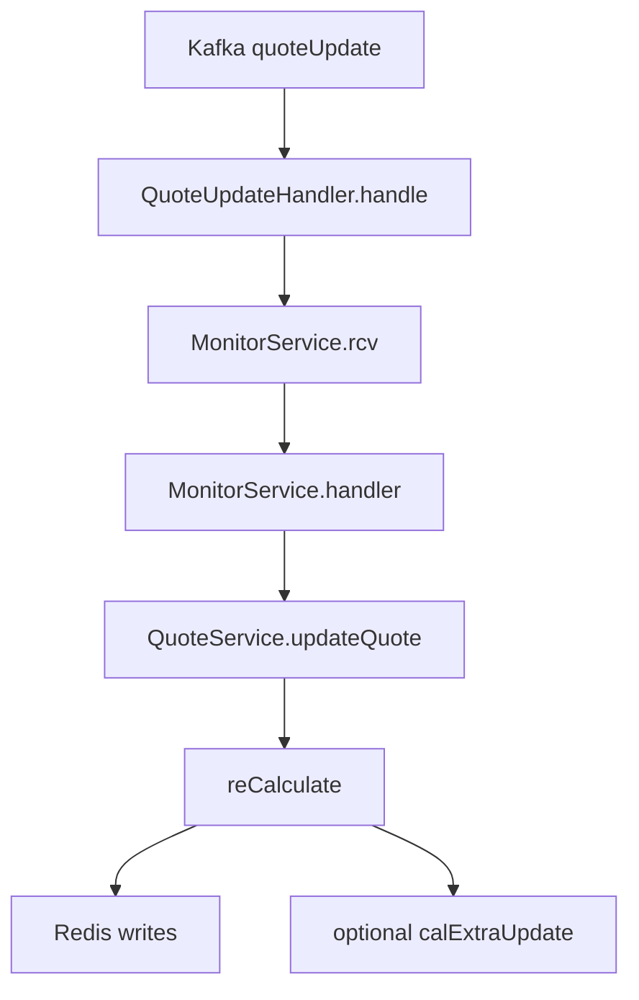

### 7.2. Input/Output ở từng lớp

| Lớp | Input | Convert | Output |
|---|---|---|---|
| `QuoteUpdateHandler.handle()` | `Message<SymbolQuote>` | null-check | `monitorService.rcv(symbolQuote)` |
| `MonitorService.rcv()` | runtime object | enqueue theo code | per-code thread queue |
| `MonitorService.handler()` | dequeued object | dispatch by type | `QuoteService.updateQuote(symbolQuote)` |
| `QuoteService.updateQuote()` | `SymbolQuote` | normalize + recalculate + write Redis | updated market state |

### 7.3. `reCalculate()` làm gì

`QuoteService.reCalculate(symbolQuote)`:

- validate có `SymbolInfo` trong cache
- validate `tradingVolume >= 0`
- nếu quote sai thứ tự volume và `enableCheckOrderQuote=true`:
  - add vào wrong-order Redis nếu bật flag
  - return `false`
- set:
  - `date`
  - `createdAt`
  - `updatedAt`
  - `milliseconds`
  - `id = code + date + tradingVolume`
- với `STOCK`:
  - tính `foreignerMatchBuyVolume`
  - tính `foreignerMatchSellVolume`
  - tính `holdVolume`
  - tính `buyAbleRatio`
  - tính `holdRatio`
- với `FUTURES`:
  - set `refCode`
- nếu high/low year đổi:
  - phát Kafka `calExtraUpdate`

### 7.4. Redis write của `QuoteService.updateQuote()`

Sau `reCalculate()` thành công:

1. update statistic:
   - `HSET realtime_mapSymbolStatistic[code]`
   - chỉ áp dụng nếu `type != INDEX`
2. update latest symbol info:
   - merge quote vào `SymbolInfo`
   - `HSET realtime_mapSymbolInfo[code]`
3. update foreigner daily:
   - merge quote vào `ForeignerDaily`
   - `HSET realtime_mapForeignerDaily[code]`
4. update symbol daily:
   - `upsertSymbolDaily(symbolQuote, symbolInfo)`
   - `HSET realtime_mapSymbolDaily[code]`
5. update minute:
   - lấy current minute từ cache hoặc Redis
   - nếu quote sang phút mới: tạo `SymbolQuoteMinute`
   - nếu cùng phút: update bar hiện tại
   - ghi lại vào `realtime_listQuoteMinute_{code}`
6. append tick:
   - `realtime_listQuote_{code}`
7. update partition meta:
   - `realtime_listQuoteMeta_{code}`

### 7.5. `realtime_listQuoteMeta_{code}` chứa gì

`ListQuoteMeta` encode thành danh sách `QuotePartition`, mỗi partition có:

```text
partition|fromVolume|toVolume|totalItems
```

Ý nghĩa:

- `partition = -1`: default partition
- `fromVolume`, `toVolume`: biên KL giao dịch của partition
- `totalItems`: số tick trong partition

`market-query-v2` dùng metadata này để query/paging tick theo `lastTradingVolume` hoặc `lastIndex`.

---

## 8. LUỒNG `bidOfferUpdate` BÊN REALTIME-V2

### 8.1. Consumer chain

| Bước | Class.method | Input | Output |
|---|---|---|---|
| 1 | `BidOfferUpdateHandler.handle()` | `Message<BidOffer>` | `monitorService.rcv(bidOffer)` |
| 2 | `MonitorService.handler()` | `BidOffer` | `BidOfferService.updateBidOffer()` |
| 3 | `BidOfferService.updateBidOffer()` | `BidOffer` | merge latest top book vào Redis |

### 8.2. `BidOfferService.updateBidOffer()` làm gì

- set `createdAt`, `updatedAt`
- nếu `enableAutoData=true`:
  - lấy `SymbolInfo` hiện tại
  - merge bid/offer vào `SymbolInfo`
  - `HSET realtime_mapSymbolInfo[code]`
  - set `sequence`
- set `id`
- nếu `enableSaveBidOffer=true`:
  - append `realtime_listBidOffer_{code}`

### 8.3. Runtime hiện tại

Deploy config đang để:

- `enableSaveBidOffer=false`
- `enableSaveBidAsk=false`

Nên bid-offer runtime hiện tại có nghĩa là:

- Redis chỉ giữ **latest book trong `SymbolInfo`**
- không giữ history list active
- Mongo không có `c_bid_offer`

---

## 9. LUỒNG `extraUpdate`, `marketStatus`, `dealNotice`, `advertised`

### 9.1. `extraUpdate`

Consumer:

- `ExtraQuoteUpdateHandler.handle()` -> `monitorService.rcv(extraQuote)` -> `ExtraQuoteService.updateExtraQuote()`

`ExtraQuoteService.updateExtraQuote()`:

- merge extra fields vào `SymbolInfo`
- `HSET realtime_mapSymbolInfo[code]`
- merge vào `ForeignerDaily`
- `HSET realtime_mapForeignerDaily[code]`
- upsert `SymbolDaily`
- `HSET realtime_mapSymbolDaily[code]`

Trong runtime websocket hiện tại, `extraUpdate` chủ yếu phát ra từ:

- `QuoteService.reCalculate()` khi high/low year đổi (`calExtraUpdate`)

Nhánh collector tạo `extraUpdate` từ `ThreadHandler` vẫn tồn tại trong code nhưng không phải active path hiện tại.

### 9.2. `marketStatus`

`MarketStatusService.updateMarketStatus()`:

1. set `id = market + "_" + type`
2. set `date`
3. `HSET realtime_mapMarketStatus[...]`
4. nếu status là `ATO` hoặc `ATC`:
   - propagate `sessions=status` tới mọi `SymbolInfo` cùng market
   - ghi lại `realtime_mapSymbolInfo`

### 9.3. `dealNotice` và `advertised`

`DealNoticeService.updateDealNotice()`:

- ensure có `SymbolInfo`
- de-dup theo `confirmNumber`
- merge PT value/volume vào `SymbolInfo`
- `HSET realtime_mapSymbolInfo[code]`
- set `id`, `date`, timestamps
- append vào `realtime_listDealNotice_{market}`

`AdvertisedService.updateAdvertised()`:

- set `id`, `date`, timestamps
- append vào `realtime_listAdvertised_{market}`

Lưu ý:

- services này active ở `realtime-v2`
- nhưng feed `dealNoticeUpdate` / `advertisedUpdate` ở runtime websocket-only hiện tại không phải mainline mà collector đang phát mỗi tick quote/bid-offer

---

## 10. LUỒNG XÓA / RESET MARKET DATA

### 10.1. `removeAutoData`

File:
- `realtime-v2/.../services/JobService.java`
- `realtime-v2/.../services/RedisService.java`

Cron runtime prod hiện tại:

- `0 55 0 * * MON-FRI`

Flow:

1. `JobService.removeAutoData()`
2. check holiday/weekend
3. `redisService.removeAutoData()`
4. `cacheService.reset()`

`RedisService.removeAutoData()` xóa:

- toàn bộ `realtime_listQuoteMinute_*`
- toàn bộ `realtime_listQuote_*`
- toàn bộ `realtime_listQuoteMeta_*`
- wrong-order quote
- recover-minute quote
- bid-offer lists
- deal notice lists
- advertised lists
- market statistic

**Không xóa** ở method này:

- `realtime_mapSymbolInfo`
- `realtime_mapForeignerDaily`
- `realtime_mapMarketStatus`

### 10.2. `refreshSymbolInfo`

Cron runtime prod:

- `0 35 1 * * MON-FRI`

`RedisService.refreshSymbolInfo()` không xóa symbol info mà reset một số field:

- `sequence = 0`
- `matchingVolume = 0`
- `matchedBy = null`
- `bidOfferList = null`
- `oddlotBidOfferList = null`
- `updatedBy = "Job Realtime refreshSymbolInfo"`

Sau đó:

- `cacheService.reset()`

### 10.3. `clearOldSymbolDaily`

Cron runtime prod:

- `0 50 22 * * MON-FRI`

`RedisService.clearOldSymbolDaily()`:

- clear `realtime_mapSymbolDaily`
- clear `cacheService.getMapSymbolDaily()`

---

## 11. LUỒNG PERSIST REDIS -> MONGODB

### 11.1. Trigger

`JobService.saveRedisToDatabase()`

Cron runtime prod hiện tại:

- `0 15,29 10,11,14 * * MON-FRI`

Tức là chạy 6 lần/ngày:

- 10:15
- 10:29
- 11:15
- 11:29
- 14:15
- 14:29

### 11.2. Flow chi tiết

```mermaid
flowchart TD
  A[JobService.saveRedisToDatabase] --> B[RedisService.saveRedisToDatabase]
  B --> C[load all SymbolInfo from Redis]
  B --> D[load all SymbolDaily from Redis]a
  B --> E[load all ForeignerDaily from Redis]
  B --> F[load all MarketStatus from Redis]
  B --> G[load DealNotice/Advertised by market]
  C --> H[MongoBulkUtils.updateInBulk c_symbol_info]
  D --> I[MongoBulkUtils.updateInBulk c_symbol_daily]
  E --> J[MongoBulkUtils.updateInBulk c_foreigner_daily]
  F --> K[MongoBulkUtils.updateInBulk c_market_session_status]
  G --> L[MongoBulkUtils.updateInBulk c_deal_notice / c_advertise]
  B --> M[updateSymbolPrevious]
  M --> N[c_symbol_previous]
```

### 11.3. Input/Output ở từng lớp

| Bước | Input | Convert | Output |
|---|---|---|---|
| 1 | Redis symbol info | `redisDao.getAllSymbolInfo()` | list `SymbolInfo` | `c_symbol_info` |
| 2 | Redis odd-lot info | `redisDao.getAllSymbolInfoOddLot()` | list `SymbolInfoOddLot` | odd-lot collection |
| 3 | Redis symbol daily | `redisDao.getAllSymbolDaily()` | list `SymbolDaily` | `c_symbol_daily` |
| 4 | Redis foreigner daily | `redisDao.getAllForeignerDaily()` | set `id=code_yyyyMMdd` cho ngày hôm nay | `c_foreigner_daily` |
| 5 | Redis market status | `redisDao.getAllMarketStatus()` | none | `c_market_session_status` |
| 6 | Redis deals/advertised | get theo market | none | `c_deal_notice`, `c_advertise` |
| 7 | `updateSymbolPrevious()` | `SymbolDaily` hôm nay | build previous/close state | `c_symbol_previous` |

### 11.4. Vì sao `quote`/`quote-minute`/`bid-ask` không vào Mongo

Code path có sẵn:

- `isSaveQuote`
- `isSaveQuoteMinute`
- `isSaveBidAsk`

Nhưng deploy scripts runtime hiện tại đang set:

- `enableSaveQuote=false`
- `enableSaveQuoteMinute=false`
- `enableSaveBidAsk=false`

Nên các nhánh sau **không chạy**:

- Redis `realtime_listQuote_*` -> Mongo `c_symbol_quote`
- Redis `realtime_listQuoteMinute_*` -> Mongo `c_symbol_quote_minute`
- Redis `realtime_listBidOffer_*` -> Mongo `c_bid_offer`

---

## 12. LUỒNG QUERY API

### 12.1. `market-query-v2` đọc intraday thế nào

| API/service | Redis input | Mongo fallback | Output |
|---|---|---|---|
| `querySymbolLatest`, `priceBoard` | `realtime_mapSymbolInfo` | không cần | latest board |
| `querySymbolQuote` | `realtime_listQuote_{code}` + `realtime_listQuoteMeta_{code}` | không dùng trong path này | tick page theo volume/index |
| `querySymbolQuoteTick` | `realtime_listQuote_{code}` | có fallback `c_symbol_quote` nếu Redis thiếu và Mongo có data | grouped tick response |
| `querySymbolQuoteMinutes` | `realtime_listQuoteMinute_{code}` | fallback `c_symbol_quote_minute` nếu Mongo có data | grouped minute response |
| `queryMinuteChartBySymbol` | `realtime_listQuoteMinute_{code}` | không dùng ở method này | minute chart |
| `querySymbolStatistics` | `realtime_mapSymbolStatistic` | không cần | statistic |
| `MarketSessionStatusService` | `realtime_mapMarketStatus` | Mongo cho historical/session query khác | market session response |

### 12.2. `querySymbolQuote()`

`SymbolService.querySymbolQuote()`:

1. đọc `realtime_listQuoteMeta_{symbol}`
2. nếu chưa có meta, tạo pseudo default partition `-1`
3. quyết định partition cần đọc theo `lastTradingVolume`
4. đọc lần lượt:
   - `realtime_listQuote_{symbol}`
   - hoặc `realtime_listQuote_{symbol}_{partition}`
5. trả `SymbolQuoteResponse[]`

### 12.3. `querySymbolQuoteMinutes()`

`SymbolService.querySymbolQuoteMinutes()` -> `CommonService.actualQueryQuoteMinuteThenGrouped()`:

1. đọc `realtime_listQuoteMinute_{symbol}`
2. filter theo `fromTime/toTime`
3. group theo `minuteUnit`
4. nếu Redis không đủ:
   - query Mongo `c_symbol_quote_minute`
   - chỉ hữu ích khi Mongo thực sự có dữ liệu

### 12.4. Runtime implication

Vì Mongo intraday hiện tại không được persist tự động:

- API intraday trên production thực tế là **Redis-first và hầu như Redis-only**
- Mongo fallback chỉ hữu ích khi có manual backfill/dump hoặc môi trường khác bật persist

---

## 13. LUỒNG `ws-v2` BROADCAST

### 13.1. Active path

`ws-v2` consume Kafka market topics trực tiếp:

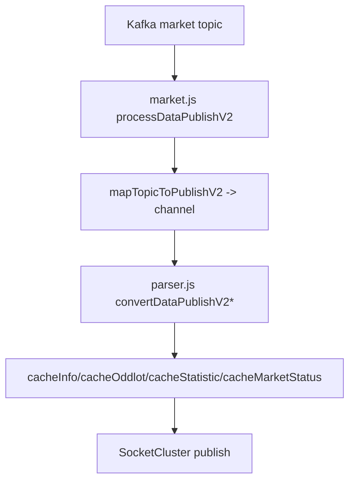

### 13.2. Topic -> channel

| Kafka topic | Channel pattern |
|---|---|
| `quoteUpdate` | `market.quote.{code}` |
| `quoteUpdateDR` | `market.quote.dr.{code}` |
| `bidOfferUpdate` | `market.bidoffer.{code}` |
| `bidOfferUpdateDR` | `market.bidoffer.dr.{code}` |
| `extraUpdate`, `calExtraUpdate` | `market.extra.{code}` |
| `marketStatus` | `market.status` |
| `dealNoticeUpdate` | `market.putthrough.deal.{market}` |
| `advertisedUpdate` | `market.putthrough.advertise.{market}` |
| `statisticUpdate` | `market.statistic.{code}` |

### 13.3. Payload rút gọn cho client

`parser.js/convertDataPublishV2Quote()` map:

- `code -> s`
  - `time -> ti`
- `open -> o`
- `high -> h`
- `low -> l`
- `last -> c`
- `change -> ch`
- `rate -> ra`
- `tradingVolume -> vo`
- `tradingValue -> va`
- `matchingVolume -> mv`
- `averagePrice -> a`
- `matchedBy -> mb`
- foreigner -> `fr`

`convertDataPublishV2BidOffer()` map:

- `bidOfferList -> bb`, `bo`
- `expectedPrice -> ep`
- `expectedChange -> exc`
- `expectedRate -> exr`
- `session -> ss`
- `totalBidVolume -> tb`
- `totalOfferVolume -> to`

### 13.4. Snapshot on subscribe

`channelSubscribeHandler()`:

- nếu `req.data.returnSnapShot === true`
- gọi `checkingReturnSnapShotInfo(req)`
- trả snapshot cache ngay lúc subscribe

---

## 14. WORKED EXAMPLES TỪ LOG THẬT

### 14.1. Ví dụ 1: `auto.qt.SHP`

Raw input:

```text
auto.qt.SHP|1|93019|SHP|93019|93019|34350.0|3|34350.0|3|34350.0|3|34350.0|3|0.0|3|0.0|...|3435000.0|100|100|83|...
```

Collector output:

```json
{
  "code":"SHP",
  "time":"023019",
  "open":34350.0,
  "high":34350.0,
  "low":34350.0,
  "last":34350.0,
  "change":0.0,
  "rate":0.0,
  "tradingVolume":100,
  "tradingValue":3435000.0,
  "matchingVolume":100,
  "type":"STOCK",
  "highTime":"093019",
  "lowTime":"093019",
  "referencePrice":34350.0,
  "averagePrice":34350.0,
  "turnoverRate":0.0000988,
  "matchedBy":"ASK",
  "activeBuyVolume":0,
  "activeSellVolume":100
}
```

Realtime output:

- `realtime_mapSymbolInfo[SHP]` updated
- `realtime_mapSymbolDaily[SHP]` updated
- `realtime_listQuote_SHP` append 1 tick
- `realtime_listQuoteMinute_SHP` create/update minute bar
- `realtime_mapSymbolStatistic[SHP]` cập nhật nhánh `ASK`

Mongo runtime hiện tại:

- không ghi tick/minute theo event
- snapshot state later only

### 14.2. Ví dụ 2: `auto.bo.BCM`

Raw input:

```text
auto.bo.BCM|1|93020|BCM|O|55800.0|2|55700.0|3|2800|55800.0|2|1800|...
```

Collector output:

```json
{
  "code":"BCM",
  "time":"023020",
  "bidOfferList":[
    {"bidPrice":55700.0,"bidVolume":2800,"offerPrice":55800.0,"offerVolume":1800},
    {"bidPrice":55600.0,"bidVolume":7100,"offerPrice":55900.0,"offerVolume":2400},
    {"bidPrice":55500.0,"bidVolume":5000,"offerPrice":56000.0,"offerVolume":8300}
  ],
  "expectedPrice":55800.0,
  "session":"LO",
  "totalOfferVolume":12500,
  "totalBidVolume":14900
}
```

Realtime output:

- merge latest order book vào `realtime_mapSymbolInfo[BCM]`
- không append history bid-offer
- không có Mongo `c_bid_offer`

### 14.3. Ví dụ 3: `auto.idxqt.09401`

Raw input:

```text
auto.idxqt.09401|1|93020|09401|VN Sustainability Index|3193.04|2|3196.71|...
```

Collector output:

```json
{
  "code":"VNSI",
  "time":"023020",
  "open":3193.04,
  "high":3196.71,
  "low":3181.96,
  "last":3192.81,
  "change":9.34,
  "rate":0.2934,
  "tradingVolume":13441469,
  "tradingValue":682724846450.0,
  "matchingVolume":20986,
  "type":"INDEX",
  "upCount":15,
  "ceilingCount":0,
  "unchangedCount":3,
  "downCount":2,
  "floorCount":0
}
```

Realtime output:

- `realtime_mapSymbolInfo[VNSI]`
- `realtime_mapSymbolDaily[VNSI]`
- `realtime_listQuote_VNSI`
- `realtime_listQuoteMinute_VNSI`
- không có `realtime_mapSymbolStatistic[VNSI]` vì `INDEX`

---

## 15. NHỮNG LUỒNG CÓ TRONG CODE NHƯNG KHÔNG PHẢI MAINLINE RUNTIME HIỆN TẠI

### 15.1. HTS/account stream path

`ThreadHandler.handle(Data)` vẫn còn trong code và có logic enrich mạnh hơn:

- `StockUpdateData`
- `IndexUpdateData`
- `FuturesUpdateData`
- `BidOfferData`
- `DealNoticeData`
- `AdvertisedData`

Ở nhánh này collector còn làm:

- `expectedChange`, `expectedRate`
- `basis` cho VN30F*
- `breakEven` cho CW
- `dealNoticeUpdate` + `extraUpdate`
- `advertisedUpdate`

Tuy nhiên deploy scripts runtime hiện tại đang để:

- `accounts: []`

Nên đây là **code path còn tồn tại nhưng không phải active path chính**.

### 15.2. Mongo intraday fallback path

`market-query-v2` vẫn có code query:

- `c_symbol_quote`
- `c_symbol_quote_minute`

Nhưng runtime hiện tại không tự động đổ dữ liệu vào hai collection đó. Vì vậy các branch này chỉ hữu ích khi:

- có manual dump/backfill
- hoặc môi trường khác bật lại flag persist

---

## 16. TÓM TẮT CUỐI

Runtime hiện tại nên hiểu như sau:

1. `market-collector-lotte` dùng **Lotte WebSocket** để ingest realtime, parse raw text thành `QuoteUpdate` / `BidOfferUpdate` / `MarketStatusData`, rồi đẩy Kafka.
2. `realtime-v2` consume Kafka, hợp nhất state và ghi vào **Redis hot state**:
   - latest symbol info
   - daily
   - foreigner daily
   - tick
   - minute
   - statistic
   - market status
3. Các job ban đêm và trong phiên:
   - `downloadSymbol` để init baseline
   - `refreshSymbolInfo`, `clearOldSymbolDaily`, `removeAutoData` để reset state
   - `saveRedisToDatabase` để snapshot Mongo
4. `market-query-v2` đọc intraday từ Redis; Mongo intraday chỉ là fallback path ở code.
5. `ws-v2` consume Kafka trực tiếp và publish realtime cho client bằng payload rút gọn.

Nếu cần đọc hệ thống theo ngôn ngữ vận hành, câu ngắn gọn nhất là:

> **Init từ API, ingest realtime từ WebSocket, hợp nhất state trong Redis, snapshot chọn lọc sang Mongo, query qua Redis-first API, và broadcast realtime qua Kafka -> ws-v2.**

---

## 17. TECHNICAL SEQUENCE FLOWS

> Phần này gộp nội dung kỹ thuật từ tài liệu cũ `08_runtime_market_data_event_sequences.md`. Mục tiêu là trace mỗi flow theo chuỗi: `raw input -> object collector -> Kafka JSON -> service xử lý -> Redis/Mongo output -> API/ws output`.

### 17.1. Sequence `downloadSymbol` -> init baseline

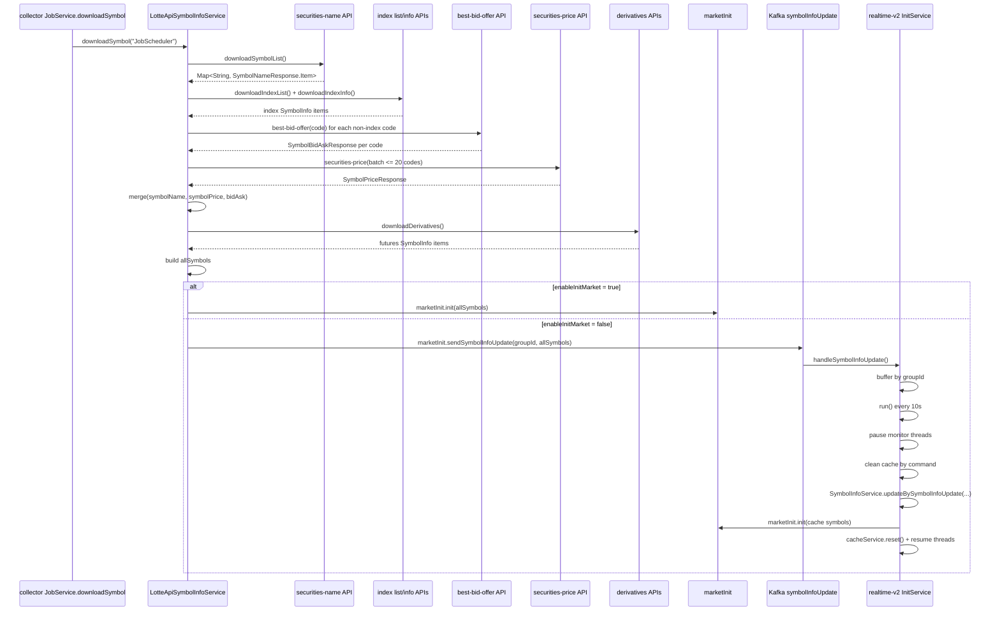

| Layer | Input | Transform | Output |
|---|---|---|---|
| `JobService.downloadSymbol()` | cron | call service | logical init request |
| `downloadSymbolList()` | REST `securities-name` | pagination | `Map<String, SymbolNameResponse.Item>` |
| `downloadIndexList()` | REST index list | pagination | index code map |
| `downloadSymbolInfo()` | REST `best-bid-offer`, `securities-price` | query + merge | `SymbolInfo` for stock/CW/ETF/bond |
| `downloadIndexInfo()` | REST index info | map fields | `SymbolInfo(type=INDEX)` |
| `downloadDerivatives()` | DR APIs | map fields | `SymbolInfo(type=FUTURES)` |
| `merge(...)` | `symbolName + symbolPrice + bidAsk` | field mapping | complete `SymbolInfo` baseline |
| `marketInit.init(allSymbols)` | `List<SymbolInfo>` | baseline market init | Redis + Mongo + static file |
| `marketInit.sendSymbolInfoUpdate(...)` | `List<SymbolInfo>` | split/group messages | Kafka `symbolInfoUpdate` |
| `InitService.run()` | grouped updates | pause / clean / apply / init | refreshed market baseline |

#### Data sample gắn vào sequence trên

Sample log thật tương ứng với các bước đầu của sequence:

| Sequence step | Sample đã có |
|---|---|
| `LOTTE->>NAMES: downloadSymbolList()` | Có log `securities-name` với `nextKey=1200`, `nextKey=1900`, item types gồm `stock` và `coveredwarrant` |
| `LOTTE->>BIDASK: best-bid-offer(code)` | Có log cho `SHB`, `CSHB2505`, `CSHB2506`, `CSHB2504`, `CSHB2509`, `CSHB2507`, `CSHB2508` |
| `LOTTE->>PRICE: securities-price(batch <= 20 codes)` | Chưa có sample raw log trong bundle hiện tại |
| `LOTTE->>IDX: downloadIndexList() + downloadIndexInfo()` | Chưa có sample raw log trong bundle hiện tại |
| `LOTTE->>DR: downloadDerivatives()` | Chưa có sample raw log trong bundle hiện tại |

Điểm đáng chú ý từ sample runtime:

- universe init lấy qua nhiều page `securities-name`, không phải một payload lớn duy nhất;
- page stock và page CW đều đi chung một flow `downloadSymbolList()`;
- `best-bid-offer` ở đầu ngày có thể chỉ cung cấp baseline trần/sàn/tham chiếu/last, còn order book thực tế vẫn rỗng;
- vì vậy baseline `SymbolInfo` đầu ngày có thể có `referencePrice`, `ceilingPrice`, `floorPrice`, `last`, nhưng `bidOfferList` rỗng và `matchingVolume = 0`.

### 17.2. Sequence `auto.qt` -> `quoteUpdate` -> Redis/API/ws

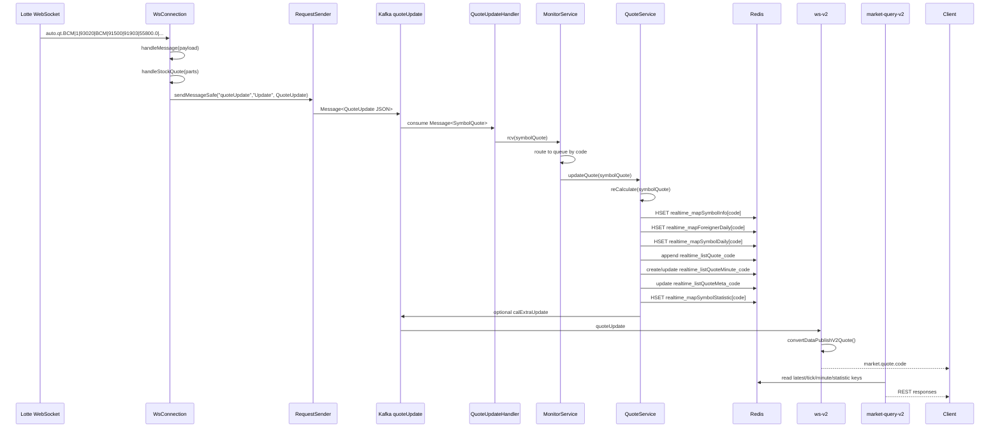

Ví dụ raw input:

```text
auto.qt.BCM|1|93020|BCM|91500|91903|55800.0|2|55800.0|2|55600.0|5|55800.0|2|100.0|2|0.179533213645|0.00292753623188|55800.0|2|55700.0|1689350000.0|30300|300|83|0|15800|351900000|342102575|0.0|0|0.0|0|5100|25200
```

`WsConnection.handleStockQuote(parts)` build `QuoteUpdate`:

| Raw segment | Output field |
|---|---|
| `parts[2]` | `time` |
| `parts[3]` | `code` |
| `parts[4]` | `highTime` |
| `parts[5]` | `lowTime` |
| `parts[6]` | `open` |
| `parts[8]` | `high` |
| `parts[10]` | `low` |
| `parts[12]` | `last` |
| `parts[14]` | `change` |
| `parts[16]` | `rate` |
| `parts[17]` | `turnoverRate` |
| `parts[18]` | `averagePrice` |
| `parts[20]` | `referencePrice` |
| `parts[21]` | `tradingValue` |
| `parts[22]` | `tradingVolume` |
| `parts[23]` | `matchingVolume` |
| `parts[24]` | `matchedBy` (`83=ASK`, `66=BID`) |
| `parts[25]` | `foreignerBuyVolume` |
| `parts[26]` | `foreignerSellVolume` |
| `parts[27]` | `foreignerTotalRoom` |
| `parts[28]` | `foreignerCurrentRoom` |
| `parts[33]` | `activeSellVolume` |
| `parts[34]` | `activeBuyVolume` |

Redis outputs:

| Redis key | Dữ liệu ghi từ event quote |
|---|---|
| `realtime_mapSymbolInfo[code]` | latest `SymbolInfo` sau khi merge quote |
| `realtime_mapForeignerDaily[code]` | foreigner daily cập nhật theo quote |
| `realtime_mapSymbolDaily[code]` | daily OHLCV trong ngày |
| `realtime_listQuote_{code}` | append 1 `SymbolQuote` tick |
| `realtime_listQuoteMinute_{code}` | create/update minute bar |
| `realtime_listQuoteMeta_{code}` | metadata partition tick |
| `realtime_mapSymbolStatistic[code]` | statistic matched by ASK/BID/UNKNOWN |

Runtime Mongo:

- không ghi `c_symbol_quote`
- không ghi `c_symbol_quote_minute`

### 17.3. Sequence `auto.bo` -> `bidOfferUpdate` -> Redis/API/ws

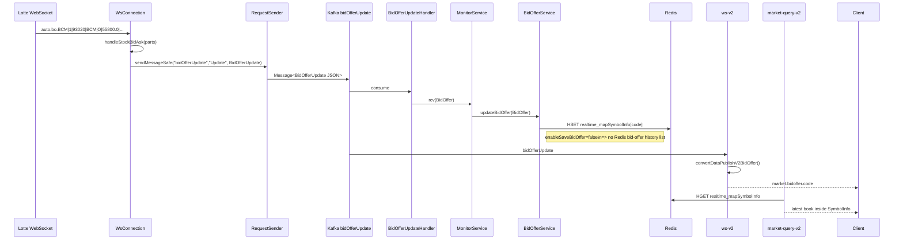

Ví dụ raw input:

```text
auto.bo.BCM|1|93020|BCM|O|55800.0|2|55700.0|3|2800|55800.0|2|1800|55700.0|3|2800|55800.0|2|1800|55600.0|5|7100|55900.0|2|2400|55500.0|5|5000|56000.0|2|8300|...|14900|12500|2400|...
```

`WsConnection.handleStockBidAsk(parts)` build:

| Raw segment | Output field |
|---|---|
| `parts[2]` | `time` |
| `parts[3]` | `code` |
| `parts[4]` | `controlCode -> session` |
| `parts[5]` | `expectedPrice` |
| `parts[13..]` | `bidOfferList` |
| `parts[73]` | `totalBidVolume` |
| `parts[74]` | `totalOfferVolume` |
| `parts[83]` | `totalBidCount` |
| `parts[85]` | `totalOfferCount` |

Runtime outputs:

| Store | Output |
|---|---|
| Redis | latest bid/offer nằm trong `realtime_mapSymbolInfo[code]` |
| Redis history list | không active vì `enableSaveBidOffer=false` |
| Mongo `c_bid_offer` | không active vì `enableSaveBidAsk=false` |

### 17.4. Sequence `auto.idxqt` -> `quoteUpdate(type=INDEX)`

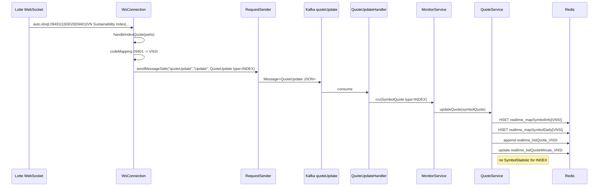

Runtime outputs:

| Output | Có / Không |
|---|---|
| `realtime_mapSymbolInfo[indexCode]` | Có |
| `realtime_mapSymbolDaily[indexCode]` | Có |
| `realtime_listQuote_indexCode` | Có |
| `realtime_listQuoteMinute_indexCode` | Có |
| `realtime_mapSymbolStatistic[indexCode]` | Không |

### 17.5. Sequence `marketStatus`

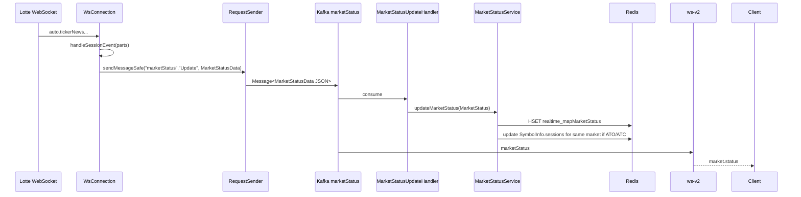

Outputs:

| Store | Output |
|---|---|
| Redis | `realtime_mapMarketStatus` |
| Redis | có thể update `realtime_mapSymbolInfo[*].sessions` |
| Mongo | `c_market_session_status` khi snapshot job chạy |
| ws-v2 | `market.status` |

### 17.6. Sequence `removeAutoData`

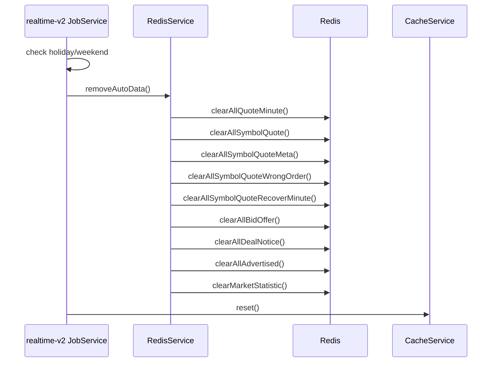

Sau job này:

| Nhóm dữ liệu | Trạng thái |
|---|---|
| tick/minute/meta/statistic | bị xóa |
| bid-offer/deal/advertised lists | bị xóa |
| `realtime_mapSymbolInfo` | giữ lại |
| `realtime_mapForeignerDaily` | giữ lại |
| `realtime_mapMarketStatus` | giữ lại |

### 17.7. Sequence `refreshSymbolInfo`

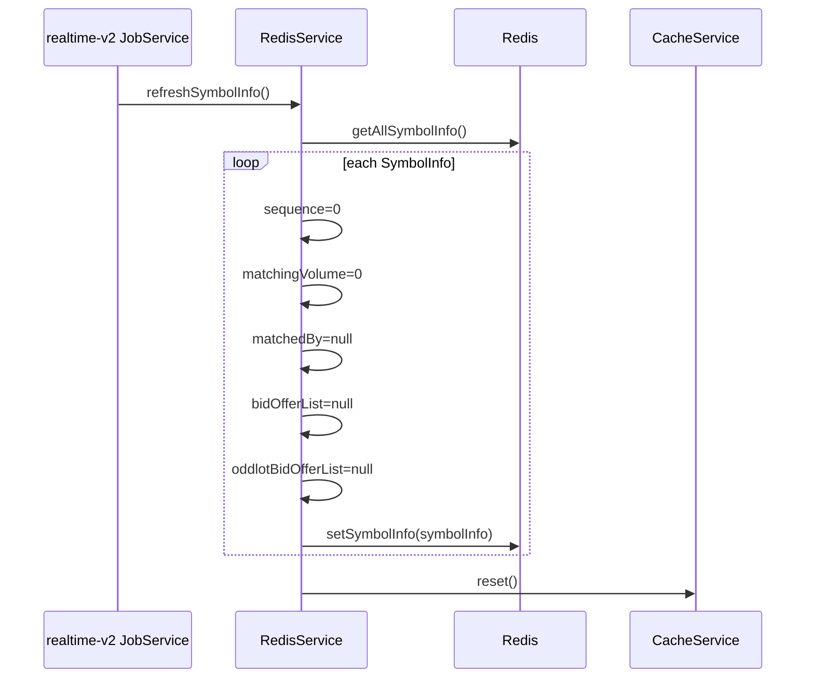

### 17.8. Sequence `clearOldSymbolDaily`

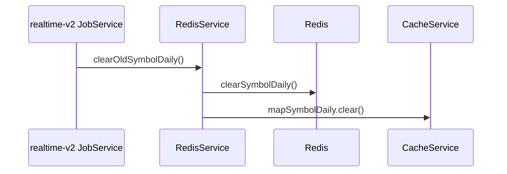

### 17.9. Sequence `saveRedisToDatabase`

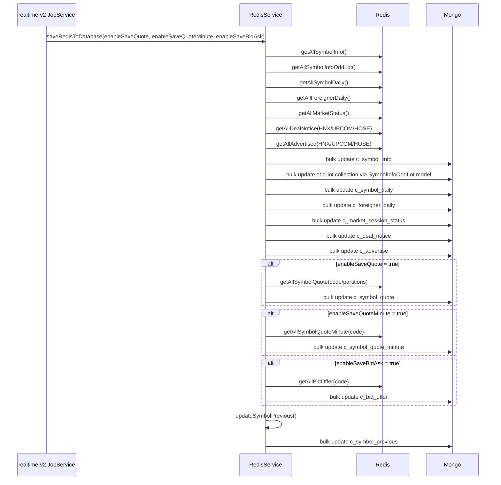

Runtime hiện tại:

- `c_symbol_quote`: không ghi
- `c_symbol_quote_minute`: không ghi
- `c_bid_offer`: không ghi

### 17.10. Sequence `querySymbolQuote` / `querySymbolQuoteTick`

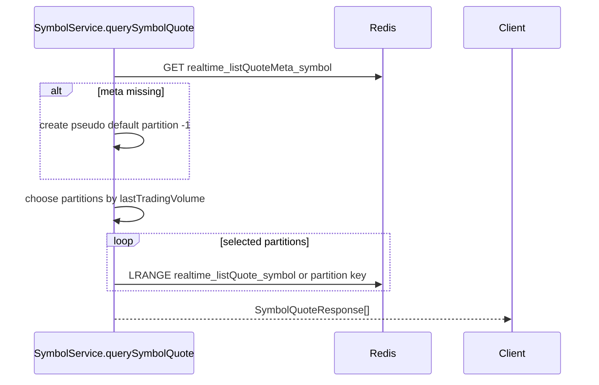

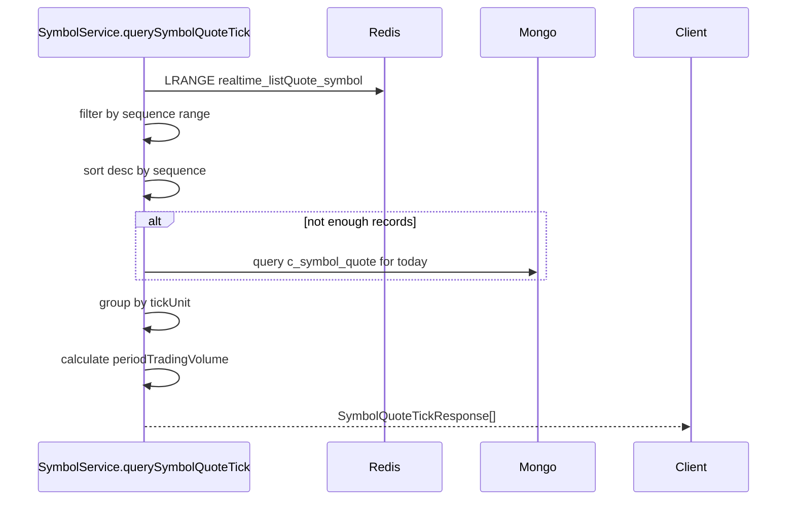

### 17.11. Sequence `querySymbolQuoteMinutes` / `queryMinuteChart`

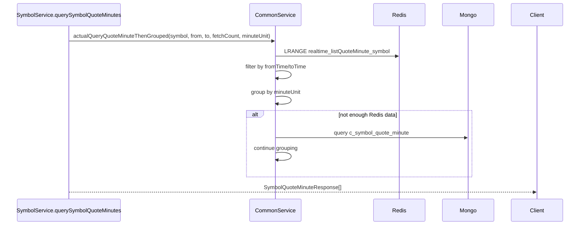

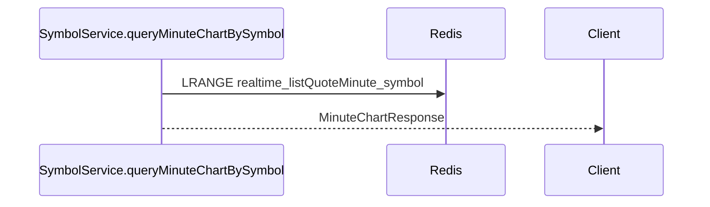

### 17.12. Sequence `ws-v2` publish + snapshot

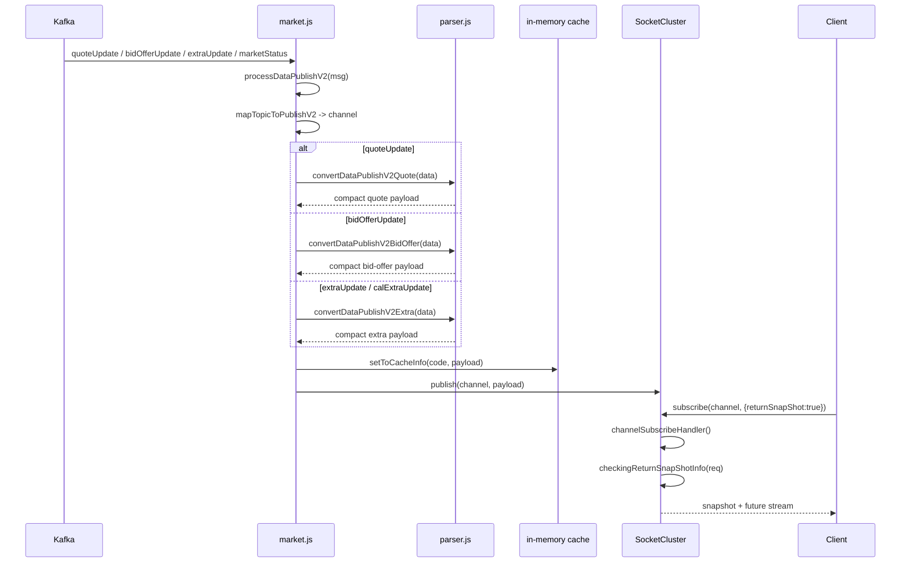

### 17.13. Nhánh có trong code nhưng không phải mainline runtime hiện tại

- `ThreadHandler.handle(Data)` của HTS/account path vẫn tồn tại và enrich sâu hơn:
  - `expectedChange`, `expectedRate`
  - `basis` cho VN30F*
  - `breakEven` cho CW
  - `dealNoticeUpdate`, `advertisedUpdate`, `extraUpdate`
- nhưng deploy scripts runtime hiện tại đang để `accounts: []`
- vì vậy chỉ nên xem đây là **supported code path**, không phải **active production path**
